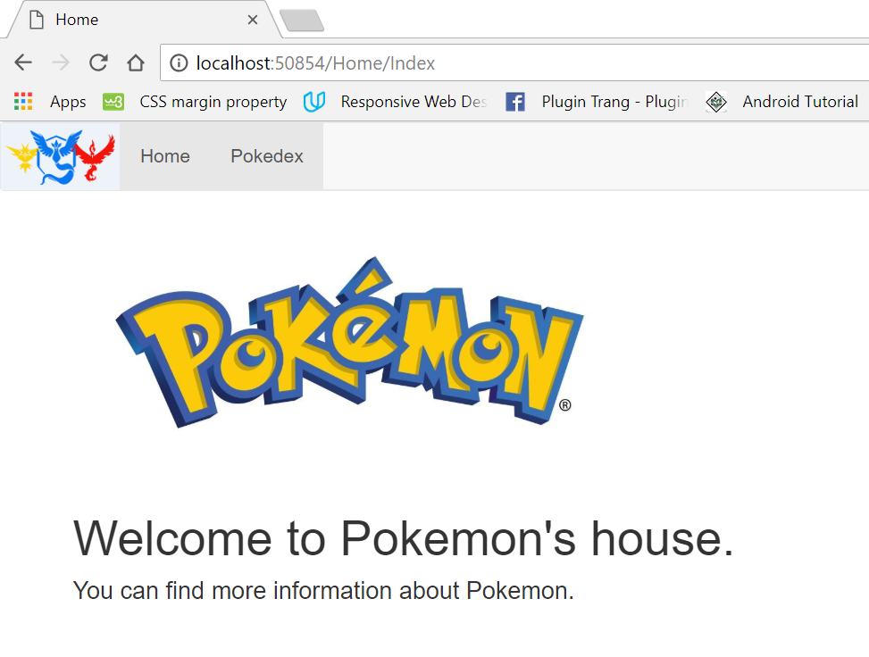
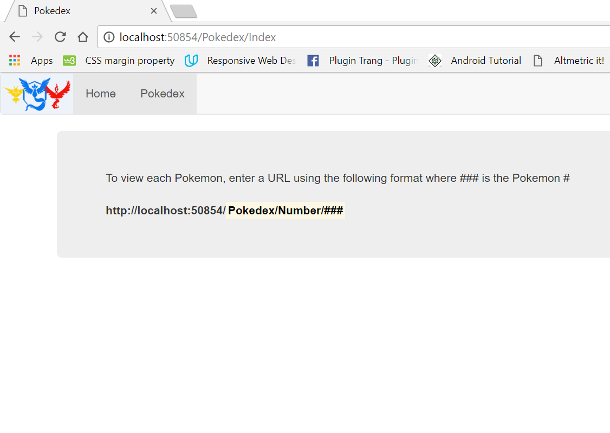
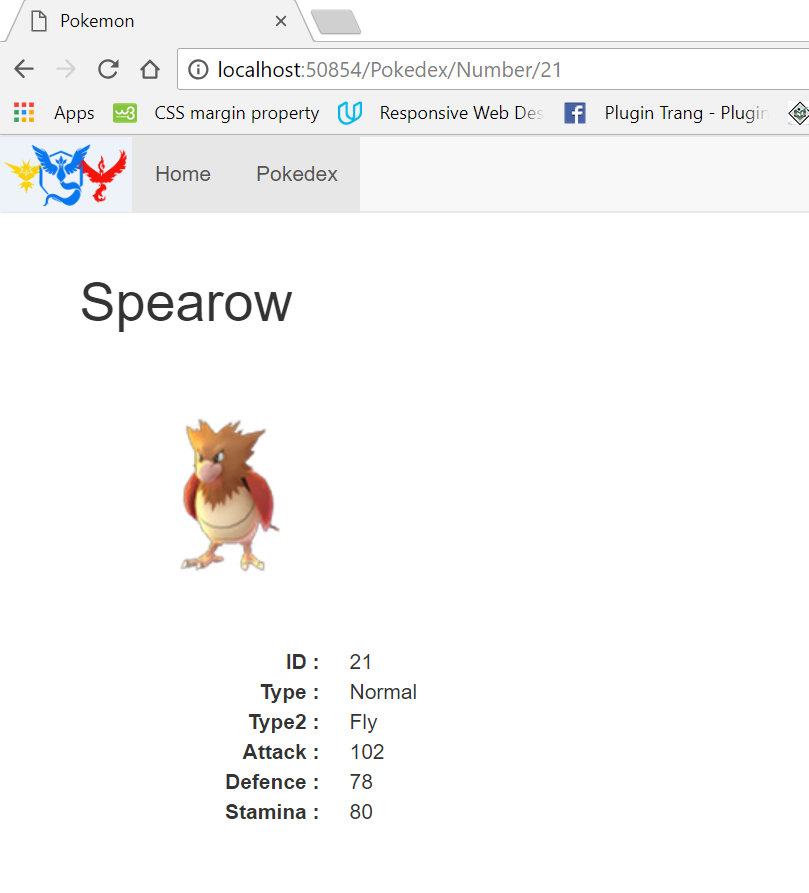
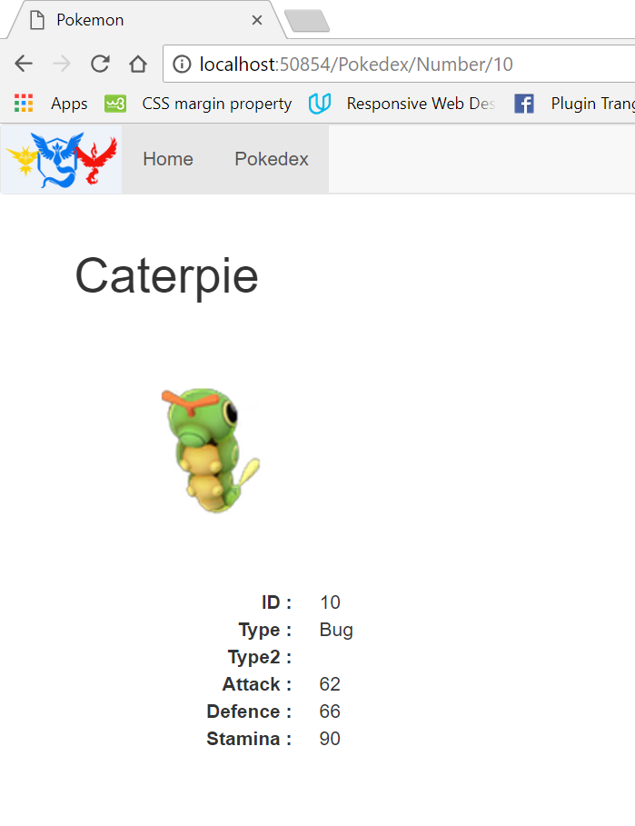

 <h5 class="w3-text-green"><b>Pokemon's House</b></h5>
 
 Framework <b> ASP.NET</b> 
 Languages: <b>C#, cshtml</b>

 
  The Pokemon Web application displays every Pokemon in the Pokedex of 149 Pokemons.  

</i>  Here are screenshots of my application.
   

 
This is the <b>Home page </b>.
   

This is the <b>Pokedex page </b>. To view the information of Pokemon, enter the URL with fomat: 
     "http://localhost:50854/Pokedex/ Number/###"  where "###" is pokemon's id. 
  

Here is an example. I changed "###" with id "21". 
  

Here is an example. I changed "###" with id "10". 
  
